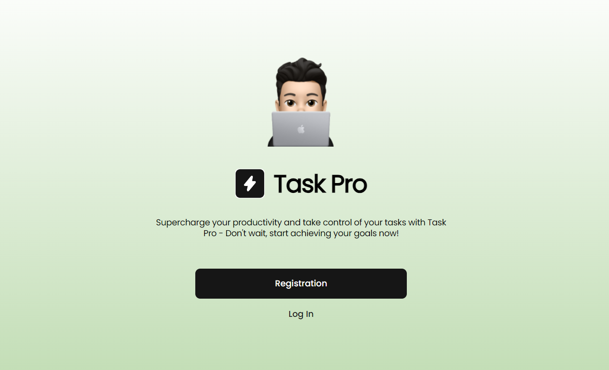

**Читати іншою мовою: [Українська](README.ua.md).**

# project-REACT_NODE



**[project-REACT_NODE](https://tkachenko01001.github.io/project-REACT_NODE/home)** -
an online tool for managing your projects by creating boards, lists, and cards
that help organize tasks and projects in a visual board format.

**Boards** - are the primary organizational element in project-REACT_NODE,
helping you structure your tasks and projects. A project-REACT_NODE board
consists of lists and cards, aiding in tracking progress, task distribution, and
collaboration with teams.

 

**Lists** - serve as the core component of a board, assisting in organizing
tasks and other elements. Each project-REACT_NODE board contains one or more
lists, and within each list, there can be various cards.


**Cards** - represent individual items such as tasks, assignments, or other work
units. They constitute the fundamental units of organization on the
project-REACT_NODE board. Each "card" has its own title, description, due date,
labels, comments, and other attributes that aid in task description and
management. You can move cards between lists on your board to indicate their
current status. Cards are highly flexible and can be used for any type of tasks
or projects, from personal to collaborative. They aid in organizing work,
storing information, and tracking progress.


**Due Dates and Notifications:** You can assign due dates (deadlines) to each
card on your board. This allows you to track when specific tasks need to be
completed. As a deadline approaches, project-REACT_NODE can send you
notifications.


**Labels and Colors** - are useful features that help you better organize and
highlight various elements on your board. Here's how these functions work:
Labels are markers that can be added to cards on your board. They help you
classify and group your tasks or items based on specific criteria. For instance,
you can use labels to denote task priorities, task types, or any other
categories relevant to your project. Colors: You can add colored labels to lists
on your board. This visually distinguishes different parts of your work. For
example, you can use different colors for different task types or project
stages. To use labels and colors in Trello, you need to open the "card" or
"list" to which you want to add labels or colors and select the appropriate
markers or colors from the respective menus. This helps you easily track and
recognize different elements on your board.


**Theme Customization:** By changing the theme to one that suits you, you can
emphasize your personal style or preference. Choosing colors, fonts, and other
visual elements helps create a comfortable working environment for you.


**Board Background Changes:** Altering the board's background can help visually
differentiate between various projects or task categories. This is particularly
useful if you have multiple boards for different purposes.


**Responsive Design and Mobile Support:** project-REACT_NODE is designed to
properly display and function on different devices with varying screen sizes,
including computers, tablets, and smartphones.і


**User Profile Editing:** Allows users to update their personal information and
settings to maintain current information and personalize their experience when
using project-REACT_NODE.


## For Users

**[project-REACT_NODE](https://tkachenko01001.github.io/project-REACT_NODE/home)**

## For Developers

**Installation:**

1. Clone the repository: git clone
   https://github.com/Tkachenko01001/project-REACT_NODE/tree/main
2. Navigate to the project directory: cd project-REACT_NODE
3. Install dependencies: npm install

**Usage:**

1. Run the project: npm start
2. Open a browser and navigate to: http://localhost:3000

## Технології:

### Frontend

- 
- 
- 
- 
- 
- 
- 
- та інші.

### BackEnd

- Mongo DB

**Project Authors:**

- https://www.linkedin.com/in/maksym-ostapchukk/
- https://www.linkedin.com/in/nataly-moskalenko/
- https://www.linkedin.com/in/anastasiia-prysiazhnaia/
- https://www.linkedin.com/in/denis-tkachenko-developer
- https://www.linkedin.com/in/lesia-brodska/
- https://www.linkedin.com/in/volodymyr-ponomarov
- https://www.linkedin.com/in/andrii-verhun/
- https://www.linkedin.com/in/viacheslav-novytskyi-22a26b278

<!-- - https://www.linkedin.com/in/oleksandrkambarov/ -->

<!-- ## Создание репозитория по шаблону

Используй этот репозиторий организации GoIT как шаблон для создания репозитория
своего проекта. Для этого нажми на кнопку `«Use this template»` и выбери опцию
`«Create a new repository»`, как показано на изображении.


На следующем шаге откроется страница создания нового репозитория. Заполни поле
его имени, убедись что репозиторий публичный, после чего нажми кнопку
`«Create repository from template»`.


После того как репозиторий будет создан, необходимо перейти в настройки
созданного репозитория на вкладку `Settings` > `Actions` > `General` как
показано на изображении.


Проскролив страницу до самого конца, в секции `«Workflow permissions»` выбери
опцию `«Read and write permissions»` и поставь галочку в чекбоксе. Это
необходимо для автоматизации процесса деплоя проекта.


Теперь у тебя есть личный репозиторий проекта, со структурой файлов и папок
репозитория-шаблона. Далее работай с ним как с любым другим личным репозиторием,
клонируй его себе на компьютер, пиши код, делай коммиты и отправляй их на
GitHub.

## Подготовка к работе

1. Убедись что на компьютере установлена LTS-версия Node.js.
   [Скачай и установи](https://nodejs.org/en/) её если необходимо.
2. Установи базовые зависимости проекта командой `npm install`.
3. Запусти режим разработки, выполнив команду `npm start`.
4. Перейди в браузере по адресу [http://localhost:3000](http://localhost:3000).
   Эта страница будет автоматически перезагружаться после сохранения изменений в
   файлах проекта.

## Деплой

Продакшн версия проекта будет автоматически проходить линтинг, собираться и
деплоиться на GitHub Pages, в ветку `gh-pages`, каждый раз когда обновляется
ветка `main`. Например, после прямого пуша или принятого пул-реквеста. Для этого
необходимо в файле `package.json` отредактировать поле `homepage`, заменив
`your_username` и `your_repo_name` на свои, и отправить изменения на GitHub.

```json
"homepage": "https://your_username.github.io/your_repo_name/"
```

Далее необходимо зайти в настройки GitHub-репозитория (`Settings` > `Pages`) и
выставить раздачу продакшн версии файлов из папки `/root` ветки `gh-pages`, если
это небыло сделано автоматически.


### Статус деплоя

Статус деплоя крайнего коммита отображается иконкой возле его идентификатора.

- **Желтый цвет** - выполняется сборка и деплой проекта.
- **Зеленый цвет** - деплой завершился успешно.
- **Красный цвет** - во время линтинга, сборки или деплоя произошла ошибка.

Более детальную информацию о статусе можно посмотреть кликнув по иконке, и в
выпадающем окне перейти по ссылке `Details`.


### Живая страница

Через какое-то время, обычно пару минут, живую страницу можно будет посмотреть
по адресу указанному в отредактированном свойстве `homepage`. Например, вот
ссылка на живую версию для этого репозитория
[https://goitacademy.github.io/react-homework-template](https://goitacademy.github.io/react-homework-template).

Если открывается пустая страница, убедись что во вкладке `Console` нет ошибок
связанных с неправильными путями к CSS и JS файлам проекта (**404**). Скорее
всего у тебя неправильное значение свойства `homepage` в файле `package.json`.

### Маршрутизация

Если приложение использует библиотеку `react-router-dom` для маршрутизации,
необходимо дополнительно настроить компонент `<BrowserRouter>`, передав в пропе
`basename` точное название твоего репозитория. Слеш в начале строки обязателен.

```jsx
<BrowserRouter basename="/your_repo_name">
  <App />
</BrowserRouter>
```

## Как это работает


1. После каждого пуша в ветку `main` GitHub-репозитория, запускается специальный
   скрипт (GitHub Action) из файла `.github/workflows/deploy.yml`.
2. Все файлы репозитория копируются на сервер, где проект инициализируется и
   проходит линтинг и сборку перед деплоем.
3. Если все шаги прошли успешно, собранная продакшн версия файлов проекта
   отправляется в ветку `gh-pages`. В противном случае, в логе выполнения
   скрипта будет указано в чем проблема. -->
